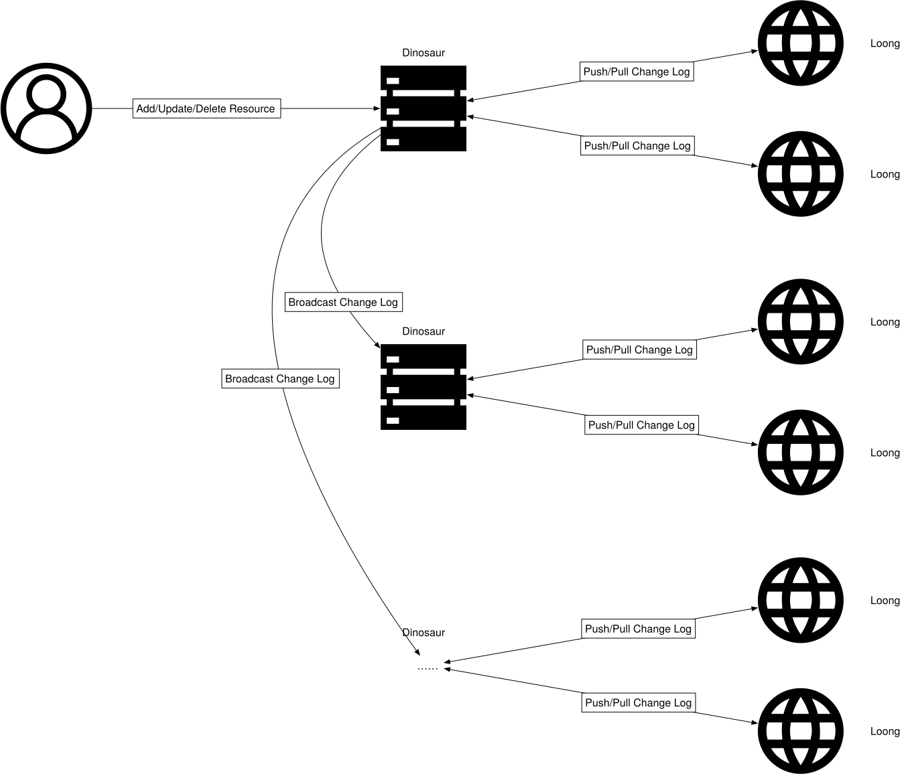

= Architecture

When a user initiates a change, the dinosaur server that receives the change will broadcast the update to other dinosaur servers. Each dinosaur server will then push the change to all loong servers connected to it.

  

== ChangeLog