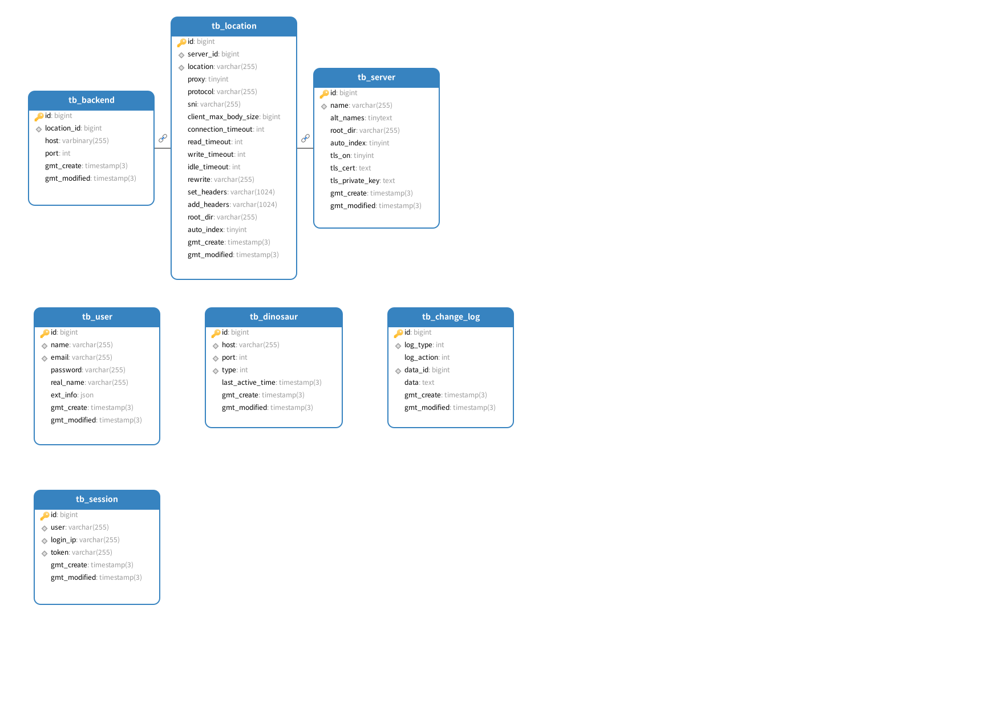

= Database

  

== tb_cluster

[cols="1,1,1,1,2"]
|===

|Name 
|Type
|Length
|Not Null
|Comment

|id
|bigint
|
|Yes
|Primary Key

|name
|VARCHAR
|255
|Yes
|

|description
|VARCHAR
|4096
|Yes
|

|gmt_create
|TIMESTAMP
|3
|Yes
|

|gmt_modified
|TIMESTAMP
|3
|Yes
|
|=== 

== tb_site

[cols="1,1,1,1,2"]
|===
|Name 
|Type
|Length
|Not Null
|Comment

|id
|bigint
|
|Yes
|Primary Key

|cluster_name
|VARCHAR
|255
|Yes
|

|name
|VARCHAR
|255
|Yes
|

|alt_names
|TINYTEXT
|255
|No
|

|root_dir
|VARCHAR
|255
|No
|

|auto_index
|TINYINT
|
|Yes
|1 true, 0 false

|tls_on
|TINYINT
|
|Yes
|1 true, 0 false

|acme_on
|TINYINT
|
|Yes
|1 true, 0 false

|tls_cert
|text
|
|No
|

|tls_cert_start_date
|DATETIME
|
|Yes
|

|tls_cert_end_date
|DATETIME
|
|Yes
|

|tls_private_key
|text
|
|No
|

|gmt_create
|TIMESTAMP
|3
|Yes
|

|gmt_modified
|TIMESTAMP
|3
|Yes
|
|=== 

== tb_location

[cols="1,1,1,1,2"]
|===

|Name 
|Type
|Length
|Not Null
|Comment

|id
|bigint
|
|Yes
|Primary Key

|site_id
|bigint
|
|Yes
|

|location
|VARCHAR
|255
|Yes
|

|proxy
|TINYINT
|
|Yes
|1 true, 0 false

|protocol
|VARCHAR
|255
|Yes
|

|sni
|VARCHAR
|255
|No
|

|client_max_body_size
|bigint
|
|No
|

|connect_timeout
|int
|
|Yes
|

|read_timeout
|int
|
|Yes
|

|write_timeout
|int
|
|Yes
|

|idle_timeout
|int
|
|Yes
|

|rewrite
|VARCHAR
|255
|No
|

|set_headers
|VARCHAR
|1024
|No
|

|add_headers
|VARCHAR
|1024
|No
|

|root_dir
|VARCHAR
|255
|No
|

|auto_index
|TINYINT
|
|Yes
|1 true, 0 false

|gmt_create
|TIMESTAMP
|3
|Yes
|

|gmt_modified
|TIMESTAMP
|3
|Yes
|
|=== 

== tb_backend

[cols="1,1,1,1,2"]
|===

|Name 
|Type
|Length
|Not Null
|Comment

|id
|bigint
|
|Yes
|Primary Key

|location_id
|bigint
|
|Yes
|

|host
|VARCHAR
|255
|Yes
|

|port
|int
|
|Yes
|

|gmt_create
|TIMESTAMP
|3
|Yes
|

|gmt_modified
|TIMESTAMP
|3
|Yes
|
|=== 

== tb_console

[cols="1,1,1,1,2"]
|===

|Name 
|Type
|Length
|Not Null
|Comment

|id
|bigint
|
|Yes
|Primary Key

|host
|VARCHAR
|255
|Yes
|

|port
|int
|
|Yes
|

|last_active_time
|TIMESTAMP
|3
|Yes
|

|gmt_create
|TIMESTAMP
|3
|Yes
|

|gmt_modified
|TIMESTAMP
|3
|Yes
|
|=== 

== tb_lock

[cols="1,1,1,1,2"]
|===

|Name 
|Type
|Length
|Not Null
|Comment

|id
|bigint
|
|Yes
|Primary Key

|lock_key
|VARCHAR
|255
|Yes
|

|host
|VARCHAR
|255
|Yes
|

|expires_at
|TIMESTAMP
|
|Yes
|

|gmt_create
|TIMESTAMP
|3
|Yes
|

|gmt_modified
|TIMESTAMP
|3
|Yes
|
|=== 

== tb_change_log

[cols="1,1,1,1,2"]
|===

|Name 
|Type
|Length
|Not Null
|Comment

|id
|bigint
|
|Yes
|Primary Key

|log_type
|int
|
|Yes
|

|log_action
|int
|
|Yes
|1 add, 2 update, 3 delete

|data_id
|bigint
|
|Yes
|

|data
|text
|
|No
|

|expire_second
|int
|
|Yes
|

|gmt_create
|TIMESTAMP
|3
|Yes
|

|gmt_modified
|TIMESTAMP
|3
|Yes
|
|=== 

== tb_session

[cols="1,1,1,1,2"]
|===

|Name 
|Type
|Length
|Not Null
|Comment

|id
|bigint
|
|Yes
|Primary Key

|user
|VARCHAR
|255
|Yes
|

|email
|VARCHAR
|255
|Yes
|

|login_ip
|VARCHAR
|255
|Yes
|

|token
|VARCHAR
|255
|Yes
|

|gmt_create
|TIMESTAMP
|3
|Yes
|

|gmt_modified
|TIMESTAMP
|3
|Yes
|
|=== 

== tb_user

[cols="1,1,1,1,2"]
|===

|Name 
|Type
|Length
|Not Null
|Comment

|id
|bigint
|
|Yes
|Primary Key

|name
|VARCHAR
|255
|Yes
|

|email
|VARCHAR
|255
|Yes
|

|passsword
|VARCHAR
|255
|Yes
|

|real_name
|VARCHAR
|255
|No
|

|ext_info
|text
|
|No
|

|gmt_create
|TIMESTAMP
|3
|Yes
|

|gmt_modified
|TIMESTAMP
|3
|Yes
|
|=== 